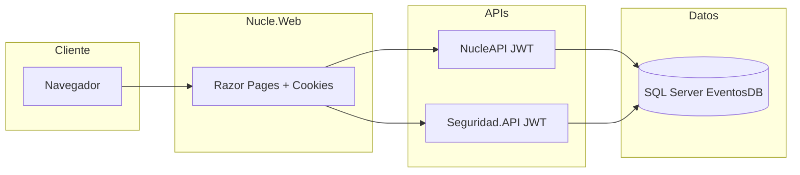

# Nuclea

**Nuclea** es un ecosistema de aplicaciones en **.NET 8** para la **gestión de eventos**: administración de eventos, tipos de evento, ubicaciones, negocios, servicios, personas, registro a eventos, generación de códigos QR y PDF, y un módulo de **seguridad** (usuarios, perfiles y autenticación). El repositorio está organizado en varias soluciones que trabajan juntas contra una base de datos **SQL Server** (`EventosDB`).

---

## Contenido del repositorio

| Carpeta | Rol |
|--------|-----|
| **`Nucle.Web`** | Interfaz web con **Razor Pages**: paneles de administración y flujos de usuario. Consume las APIs por HTTP. |
| **`NucleAPI`** | API REST principal del dominio de eventos: CRUD, registro a eventos, integraciones (QR, PDF, correo). Protegida con **JWT**. |
| **`Seguridad.API`** | API de **autenticación** y **gestión de usuarios** (registro, perfiles, asignación de roles). También usa **JWT**. |
| **`AutorizacionMiddleware`** | Código fuente de los paquetes NuGet **Autorizacion.*** (abstracciones, acceso a datos, flujo y middleware de autorización por claims). Los proyectos `Nucle.Web` y `NucleAPI` suelen consumir estas librerías ya publicadas en NuGet; esta carpeta sirve para mantener o evolucionar ese middleware. |

---

## Arquitectura (visión general)

- **Patrón por capas** en cada solución: **Abstracciones** (contratos y modelos), **Acceso a datos** (Dapper / repositorios), **Flujo** (orquestación de casos de uso), **Reglas** o lógica de negocio donde aplica, y la capa de presentación (**API** o **Razor Pages**).
- **Nucle.Web** usa **autenticación por cookies** y el middleware de autorización **Autorizacion.Middleware** para resolver permisos según claims.
- **NucleAPI** y **Seguridad.API** exponen controladores REST y validan **JWT** con la misma idea de emisor, audiencia y clave simétrica configurada en `appsettings`.
- La web no accede directamente a la base de datos del negocio para la mayoría de operaciones: llama a **NucleAPI** y **Seguridad.API** mediante URLs configuradas en `appsettings.json`.



---

## Requisitos previos

- [.NET 8 SDK](https://dotnet.microsoft.com/download/dotnet/8.0)
- **SQL Server** (LocalDB, Express o instancia completa) accesible desde tu máquina
- **Visual Studio 2022** (recomendado) o **VS Code** con extensión C#
- Para publicar o modificar **AutorizacionMiddleware**: cuenta de NuGet si vas a empaquetar nuevas versiones (opcional para solo ejecutar el resto del sistema)

---

## Base de datos

Hay proyectos **SQL Server Database** (`.sqlproj`) que definen tablas y procedimientos almacenados:

- `NucleAPI/BD/BD.sqlproj` — esquema principal del dominio de eventos
- `Seguridad.API/BD/BD.sqlproj` — elementos relacionados con seguridad (según lo incluido en ese proyecto)

**Pasos típicos:**

1. Crea (o restaura) la base **`EventosDB`** en tu instancia de SQL Server.
2. Desde Visual Studio: clic derecho en el proyecto `.sqlproj` → **Publicar** y apunta a tu servidor y base de datos, **o** ejecuta los scripts generados según tu flujo de despliegue.

**Script completo (opcional):** en `NucleAPI/BD/Scripts/NucleaDBEventos.sql` hay un volcado que crea la base **`EventosDB`** y el esquema. Está enlazado al proyecto **BD** en Visual Studio (carpeta *Scripts*). Si el `CREATE DATABASE` trae rutas fijas de archivos `.mdf`/`.ldf` de otra PC, edítalas o crea la base a mano y ejecuta solo la parte del script que aplica tablas y procedimientos.

Las cadenas de conexión por defecto en los `appsettings` usan:

- `Data Source=Localhost;Initial Catalog=EventosDB;Integrated Security=True;Encrypt=False`

Ajusta servidor, base de datos, usuario y contraseña según tu entorno.

---

## Configuración sensible (importante)

En **`NucleAPI`** conviene no dejar en el repositorio:

- Clave JWT (`Token:key`) — usa una clave larga y aleatoria en producción.
- **ApiKey** y **TemplateId** de CraftMyPDF (generación de PDF).
- Credenciales **SMTP** (`MailSettings`).

En desarrollo puedes usar **User Secrets** o variables de entorno y sobrescribir `appsettings.Development.json` (asegúrate de que ese archivo con secretos reales esté en `.gitignore` si lo usas así).

```bash
cd NucleAPI/NucleAPI
dotnet user-secrets init
# Ejemplo: dotnet user-secrets set "Token:key" "tu-clave-segura"
```

---

## Cómo ejecutar el sistema (orden recomendado)

Las URLs en `appsettings` asumen HTTPS en puertos concretos; si cambias puertos en `launchSettings.json`, actualiza también **`ApiEndPoints`**, **`ApiEndPointsSeguridad`** (en `Nucle.Web`) y **`ApiSeguridad`** (en `NucleAPI`).

### 1. Seguridad.API

```bash
cd Seguridad.API/API
dotnet run --launch-profile https
```

Por defecto (perfil **https**): **https://localhost:7253** — Swagger en `/swagger`.

### 2. NucleAPI

```bash
cd NucleAPI/NucleAPI
dotnet run --launch-profile https
```

Por defecto: **https://localhost:7289** — Swagger en `/swagger`.

### 3. Nucle.Web

```bash
cd Nucle.Web/Web
dotnet run --launch-profile https
```

Por defecto: **https://localhost:7109** — la aplicación Razor Pages.

**Orden lógico:** primero la base de datos, luego **Seguridad.API**, luego **NucleAPI**, y por último **Nucle.Web**, porque la web depende de ambas APIs en tiempo de ejecución.

---

## APIs principales (resumen)

### NucleAPI (`/api` según enrutado)

Controladores orientados al dominio de eventos, entre otros:

- **Eventos** — CRUD de eventos
- **TipoEvento** — tipos de evento
- **Ubicacion** — ubicaciones
- **Negocios** — negocios asociados
- **Servicios** — servicios
- **Persona** — personas
- **RegistroEvento** — registro de participantes / consulta de registros

Integraciones configurables:

- Generación de **QR** (API externa configurable)
- Generación de **PDF** (CraftMyPDF)
- **Correo** SMTP para notificaciones

### Seguridad.API (`/API` según configuración)

- **Autenticacion** — login (JWT)
- **Usuario** — registro, listado, perfiles, asignación de perfiles, eliminación, etc.

La documentación interactiva está disponible en **Swagger** en modo desarrollo.

---

## Nucle.Web (interfaz)

- **Razor Pages** con Bootstrap y recursos estáticos en `wwwroot`.
- Rutas de cuenta: login, logout, acceso denegado (cookies).
- Páginas de administración y mantenimiento para eventos, tipos de evento, ubicaciones, negocios, servicios y usuarios, alineadas con los endpoints configurados en `ApiEndPoints` y `ApiEndpointsSeguridad`.

---

## AutorizacionMiddleware

Solución independiente que produce paquetes como **Autorizacion.Abstracciones**, **Autorizacion.DA**, **Autorizacion.Flujo** y **Autorizacion.Middleware**. Si solo vas a **usar** Nuclea y no a modificar el middleware, no necesitas compilar esta carpeta: los proyectos web y API ya referencian versiones NuGet (por ejemplo **2.0.6**).

Para trabajar en el middleware: abre `AutorizacionMiddleware/AutorizacionMiddleware.sln`, compila y empaqueta según tu flujo interno.

---

## Soluciones (.sln)

| Archivo | Proyectos |
|---------|-----------|
| `Nucle.Web/Nucle.web.sln` | Web, Abstracciones, Reglas |
| `NucleAPI/NucleAPI/NucleAPI.sln` | API, capas de dominio, BD |
| `Seguridad.API/Seguridad.sln` | API de seguridad y capas |
| `AutorizacionMiddleware/AutorizacionMiddleware.sln` | Paquetes de autorización |

No hay un único `.sln` en la raíz: abre la solución que corresponda a lo que estés desarrollando.

---

## Tecnologías destacadas

- **ASP.NET Core 8** (Web API + Razor Pages)
- **Dapper** para acceso a datos
- **JWT Bearer** y **Cookie** authentication
- **Swagger / Swashbuckle**
- **SQL Server** (proyectos SSDT)
- Paquetes **Autorizacion.*** para middleware de autorización basado en claims

---

## Licencia y contribuciones

Si el repositorio es privado o de equipo, documenta aquí la licencia y el proceso de contribución (ramas, revisiones, etc.) según las reglas de tu organización.

---

## Resumen rápido

1. Publica **EventosDB** desde los `.sqlproj` o tus scripts.
2. Ajusta **connection strings** y secretos (JWT, PDF, correo).
3. Ejecuta **Seguridad.API** → **NucleAPI** → **Nucle.Web**.
4. Entra a la web en **https://localhost:7109** (o el puerto que definas) y usa Swagger en las APIs para probar endpoints.

Si algo falla por CORS, HTTPS o puertos, revisa que las URLs en `appsettings` coincidan con los perfiles de `launchSettings.json` de cada proyecto.
